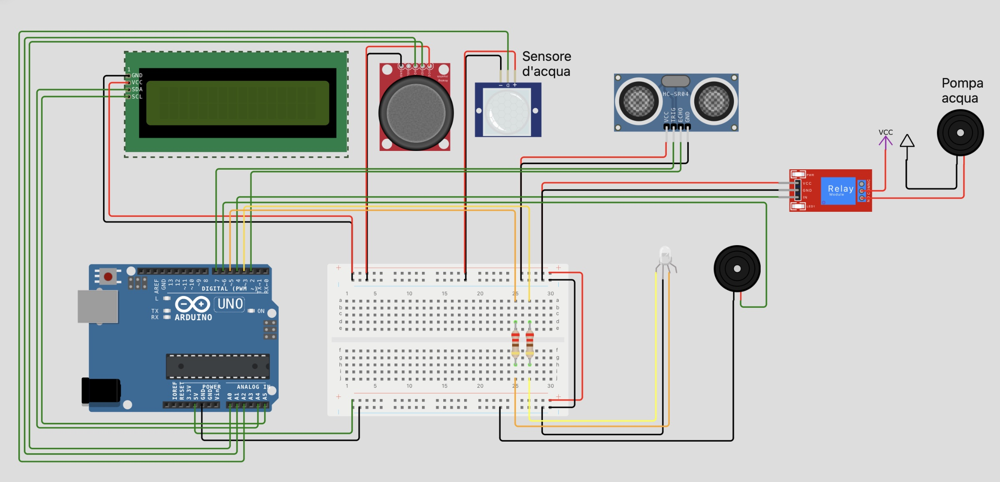

# Refiller d'acqua

Autore: Aguirre Pablo

## Descrizione
Il progetto consiste in un refiller d'acqua automatico (pensato per essere usato su una scrivania) avente le seguenti funzionalità:
- __rifornimento normale__: quando si posiziona un bicchiere sulla "stazione", esso viene rifornito 
- __reminder__: impostando un timer, è possibilità ricevere una "notificha" per ricordare all'utente di bere
- __obiettivo__: si può impostare un obiettivo da raggiungere (in litri), quando esso viene raggiunto viene mostrata una notifica
- __visualizzazione /modifica__: si può in qualsiasi momento modificare obiettivo/reminder e visualizzare l'acqua bevuta fino a quel momento

## Lista materiali
- 1 Arduino UNO
- 1 display LCD
- 1 modulo I2C (per LCD)
- 1 joystick analogico
- 1 LED a due colori (giallo e rosso)
- 1 relè 5V DC
- 1 sensore capacitivo per l'acqua
- 1 pompa acqua da immersione
- 1 tubo da 1m
- 1 buzzer
- 1 sensore ad ultrasuoni HC-SR04
- 2 resistenze da 220 $\Omega$
- 1 porta batterie AA
- 1 breadboard
- 2 batterie AA
- 1 batteria a $9\text V$

  
## Circuito

--